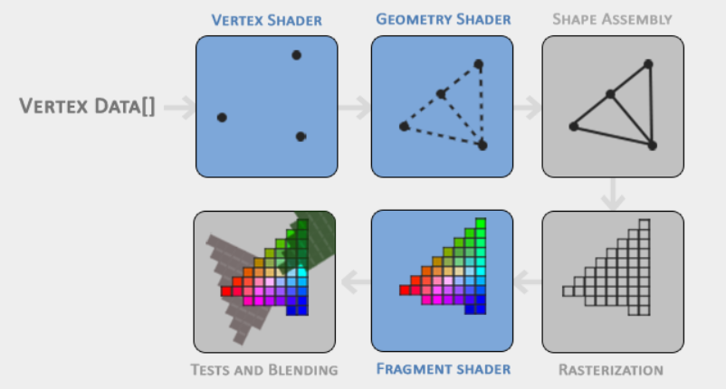

# Graphics pipeline

The graphics pipeline's job can be split between two macro-steps: in the first one transforms 3D coordinates into 2D coordinates; the second one transforms 2D coordinates into actual colored pixels. Let's unwrap these two steps into the real graphics pipeline.

The graphics pipeline can be divided into several **steps** where each step requires the output of the previous step as its input. All of these steps are highly specialized (they have one specific function) and can easily be executed in **parallel**. Because of their parallel nature, graphics cards of today have thousands of small processing cores to quickly process your data within the graphics pipeline. The processing cores run small programs on the GPU for each step of the pipeline. These small programs are called **shaders**.

Some of these shaders are **configurable** by the developer which allows us to write our own shaders to replace the existing default shaders. This gives us much more fine-grained control over specific parts of the pipeline and because they run on the GPU, they can also save us valuable CPU time. Shaders are written in the OpenGL Shading Language (GLSL).

Here an abstract representation of all the stages of the graphics pipeline (blue sections represent sections where we can inject our own shaders):

## Input

As input to the graphics pipeline we pass in a list of three 3D coordinates that should form a triangle in an array here called **Vertex Data**; this vertex data is a collection of vertices. A **vertex** is a collection of data per 3D coordinate. This vertex's data is represented using vertex attributes that can contain any data we'd like.

**Important**: In order for OpenGL to know what to make of your collection of coordinates and color values, OpenGL requires you to hint what kind of **render types** you want to form with the data (a collection of points, a collection of triangles or a line).
\
Those hints are called **primitives** and are given to OpenGL while calling any of the drawing commands. Some of these hints are `GL_POINTS`, `GL_TRIANGLES` and `GL_LINE_STRIP`.

## Vertex shader

The first part of the pipeline is the **vertex shader** that takes as input a single vertex. The main purpose of the vertex shader is to transform 3D coordinates into different 3D coordinates and the vertex shader allows us to do some basic processing on the vertex attributes.

## Geometry shader

The output of the vertex shader stage is optionally passed to the **geometry shader**. The geometry shader takes as input a collection of vertices that form a primitive and has the ability to generate other shapes by emitting new vertices to form new (or other) primitive(s). In this example case, it generates a second triangle out of the given shape.

## Shape assembly

The **primitive assembly** stage takes as input all the vertices (or vertex if `GL_POINTS` is chosen) from the vertex (or geometry) shader that form one or more primitives and assembles all the point(s) in the primitive shape given; in this case two triangles.

## Rasterization stage

The output of the primitive assembly stage is then passed on to the **rasterization** stage where it maps the resulting primitive(s) to the corresponding pixels on the final screen, resulting in fragments for the fragment shader to use. Before the fragment shaders run, **clipping** is performed. Clipping discards all fragments that are outside your view, increasing performance.

_Note_: A **fragment** in OpenGL is all the data required for OpenGL to render a single pixel.

## Fragment shader

The main purpose of the **fragment shader** is to calculate the final color of a pixel and this is usually the stage where all the advanced OpenGL effects occur. Usually the fragment shader contains data about the 3D scene that it can use to calculate the final pixel color (like lights, shadows, color of the light and so on).

## Test and blending

After all the corresponding color values have been determined, the final object will then pass through one more stage that we call the **alpha test and blending stage**. This stage checks the corresponding depth and stencil value of the fragment and uses those to check if the resulting fragment is in front or behind other objects and should be discarded accordingly. The stage also checks for alpha values and blends the objects accordingly. So even if a pixel output color is calculated in the fragment shader, the final pixel color could still be something entirely different when rendering multiple triangles.

_Note_: **alpha values** define the opacity of an object.

## Tessellation

## Transform feedback loop
